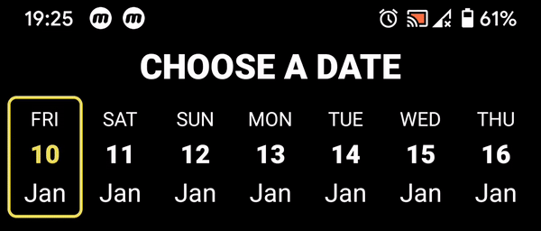

# SingleRowCalendar
With this library, you aren't attached to library built-in UI. You can create really beautiful and customizable UI and use selection features without hands getting dirty with RecyclerView and SelectionTracker.

[ ](https://bintray.com/michalsvec/android-libraries/single-row-calednar/_latestVersion)
[](https://github.com/miso01/SingleRowCalendar/blob/master/LICENSE)
[](https://www.paypal.com/cgi-bin/webscr?cmd=_s-xclick&hosted_button_id=EFH6LSWRHAQ4J&source=url)
[](https://github.com/miso01/SingleRowCalendar/tree/master/app/src/main)
[](https://medium.com/@misosvec01/single-row-horizontal-calendar-has-never-been-easier-6ad989fafee8)

  
  

## FEATURES
* single selection
* multiple selection
* enable/disable long press to start selection
* enable/disable deselection
* set count of dates in past or future, or you can provide your dates
* initial position
* easily observe for changes in selection
* control selection of particular items using selection manager 
* programmatically deselect and select items
* check if the item is selected
* set selection
* clear selection
* and more...

## INSTALLATION
#### GRADLE 
```
dependencies {
    implementation 'com.michalsvec:single-row-calednar:1.0.0'
}
```

#### MAVEN
```
<dependency>
	<groupId>com.michalsvec</groupId>
	<artifactId>single-row-calednar</artifactId>
	<version>1.0.0</version>
	<type>pom</type>
</dependency>
```

## USAGE
#### 1. create calendar item view layout files
* create layout files, which will be defining how you calendar will look like <br>
* basic item - selected and deselected <br>
  

#### 2. create special calendar item view layout files (optional)
* if you need some special items, which will be displayed accroding to your logic you can add them 
* special item - selected and deselected <br>
 

#### 3. add SingleRowCalendar to your activty or fragment layout file

```xml
<com.michalsvec.singlerowcalendar.calendar.SingleRowCalendar
        android:id="@+id/main_single_row_calendar"
        android:layout_width="match_parent"
        android:layout_height="wrap_content"
        android:layout_marginStart="16dp"
        android:layout_marginTop="16dp"
        android:layout_marginEnd="16dp"
        app:deselection="false"
        app:longPress="false"
        app:multiSelection="false" />
```

#### 4. setup CalendarViewManager

```kotlin
val myCalendarViewManager = object : CalendarViewManager {  
    override fun setCalendarViewResourceId(                 
        position: Int,                                      
        date: Date,                                         
        isSelected: Boolean                                 
    ): Int {                                                
        // return item layout files, which you have created 
    }                                                       
                                                            
    override fun bindDataToCalendarView(                    
        holder: SingleRowCalendarAdapter.CalendarViewHolder,
        date: Date,                                         
        position: Int,                                      
        isSelected: Boolean                                 
    ) {                                                     
        // bind data to calendar item views                 
    }                                                       
}  
```

#### 5. setup CalendarSelectionManager

```kotlin
val mySelectionManager = object : CalendarSelectionManager {             
    override fun canBeItemSelected(position: Int, date: Date): Boolean { 
        // return true if item can be selected                           
    }                                                                    
}
```

#### 6. setup CalendarChangesObserver
```kotlin
val myCalendarChangesObserver = object : CalendarChangesObserver {                                                            
    override fun whenWeekMonthYearChanged(weekNumber: String,monthNumber: String,monthName: String,year: String,date: Date) { 
        super.whenWeekMonthYearChanged(weekNumber, monthNumber, monthName, year, date)                                        
    }                                                                                                                         
                                                                                                                              
    override fun whenSelectionChanged(isSelected: Boolean, position: Int, date: Date) {                                       
        super.whenSelectionChanged(isSelected, position, date)                                                                
    }                                                                                                                         
                                                                                                                              
    override fun whenCalendarScrolled(dx: Int, dy: Int) {                                                                     
        super.whenCalendarScrolled(dx, dy)                                                                                    
    }                                                                                                                         
                                                                                                                              
    override fun whenSelectionRestored() {                                                                                    
        super.whenSelectionRestored()                                                                                         
    }                                                                                                                         
                                                                                                                              
    override fun whenSelectionRefreshed() {                                                                                   
        super.whenSelectionRefreshed()                                                                                        
    }   
```
}  


#### 7. provide dates and init SingleRowCalendar in your code
You can choose between two ways of doing it. If you want simple provide few past of future days, you should specify these attributes ```pastDaysCount```, ```futureDaysCount``` and ```includeCurrentDate``` in an XML or directly in code. 
If you are not satisfied with the previous solution you can specify your own list of dates using ```setDates``` function. 
When you provide dates to the calendar you can also set you initial position using this property ```initialPositionIndex```.

```kotlin
val singleRowCalendar = main_single_row_calendar.apply {        
    calendarViewManager = myCalendarViewManager                
    calendarChangesObserver = myCalendarChangesObserver        
    calendarSelectionManager = mySelectionManager              
    futureDaysCount = 30                                       
    includeCurrentDate = true                                  
    init()                                                     
}                                                              
```

## PARAMETERS AND FUNCTIONS
* ```pastDaysCount```
  * number of days in past displayed in the calendar
* ```futureDaysCount```
  * number of days in future displayed in the calendar
* ```includeCurrentDate```
  * include current date in the calendar
* ```initialPositionIndex```
  * first displayed item in the calendar
* ```multiSelection```
  * enable or disable multi selection
* ```deselection```
  * enable or disable deselection 
* ```longPress```
  * first selected item starts with a long press
* ```calendarChangesObserver```  
  * using this callback we can observe for changes in the calendar
* ```calendarViewManager```  
  * this callback is responsible for inflating item views to calendar
* ```calendarSelectionManager```  
  * using this callback we can enable or disable selection for particular items 
* ```setDates(newDateList: List<Date>)```  
  * when you don't want to use ```pastDaysCount``` and ```futureDaysCount``` you can specify your list of dates
* ```getDates()```
  * returns used dates in the calendar
* ```getSelectedIndexes()```
  * returns list of selected postions
* ```getSelectedDates()```
  * returns list of selected dates
* ```onSaveInstanceState(state: Bundle)```
  * preserves selection
* ```onRestoreInstanceState(state: Bundle)```
  * restores selection from previously saved state
* ```hasSelection()```
  * returns true if calednar has any item selected
* ```isSelected(position: Int)```
  * check if particular item is selected
* ```deselect(position: Int)```
  * attempts to deselect an item
* ```select(position: Int)```
  * attempts to select an item 
* ```setItemsSelected(positionList: List<Int>, selected: Boolean)```
  * you can select or deselect multiple items at once
* ```clearSelection()```
  * deselect all items in the calendar 

### DateUtils class
You can use DateUtils class when you want get some values from date. 
* ```getDayName(date: Date)```
  * returns day name, for example Friday, Thursday, Monday, etc...
* ```getDay3LettersName(date: Date)```
  * returns day abbreviation, for example Fri, Thu, Mon, etc...
* ```getDay1LetterName(date: Date)```
  * returns day abbreviation, for example F, T, M, S, etc...
* ```getMonthNumber(date: Date)```
  * returns month number, for example 1, 3, 12, 9, etc...
* ```getMonthName(date: Date)```
  * returns month name, for example December, September, January, etc...
* ```getMonth3LettersName(date: Date)```
  * returns month abbreviation, for example Jan, Feb, Dec, etc...
* ```getYear(date: Date)```
  * returns year, for example 2010, 2019, 2020, 2034...
* ```getDayNumber(date: Date)```
  * returns number of day in a month, for example 15, 16, 17, etc...
* ```getNumberOfWeek(date: Date)```
  * returns number of week in a year, for example 1, 5, 22, 50 etc...
* ```getFutureDates(count: Int)```
  * returns a list of future dates with specified length
* ```getPastDates(count: Int)```
  * returns a list of past dates with specified length 
* ```getDates(pastDays: Int, futureDays: Int, includeCurrentDate: Boolean)```  
  * returns a list of dates with specified parameters
  
## CONTRIBUTE
* the best way to submit a patch is to send me a pull request
* to report a specific problem or feature request, open a new issue on Github
* follow this contribution [rules](https://github.com/miso01/SingleRowCalendar/blob/docs/CONTRIBUTE.md)

## SEND ME YOUR CREATIONS
* feel free to contact me and send me your app [here](https://github.com/miso01/SingleRowCalendar/blob/docs/CONTACT.md)
* potentially your calendar can be here as a presentation of the library 

## LICENSE 
The library is licensed under [Apache License](https://github.com/miso01/SingleRowCalendar/blob/docs/LICENSE). 
